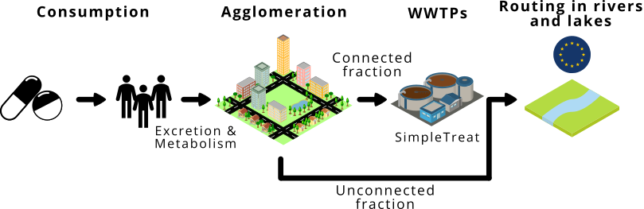
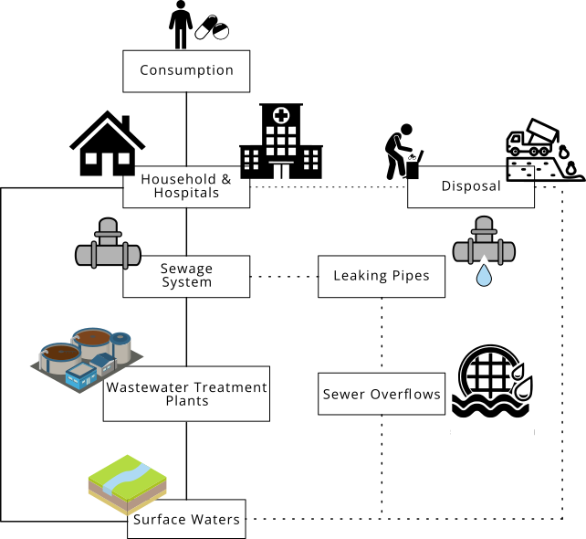

# Theoretical Background
## The ePiE model

The first version of the ePiE model was developed in 2018 by Oldenkamp et al. (2018) (<mark>**CITATION**</mark>) as part of the IMI's i-PiE (Innovative Medicines Initiative; Intelligence-led Assessment of Pharmaceuticals in the Environment) project and was subsequently further developed as part of the PREMIER (Prioritisation and Risk Evaluation
of Medicines in the EnviRonment) project ([https://imi-premier.eu/](https://imi-premier.eu/)).

The ePiE model predicts concentrations of APIs for human use in European rivers and waters based on consumption data of APIs, and API and environmental characteristics. It provides a broad-scale, steady-state assessment of PECs in European river basins and combines the need for a spatially explicit model, computational efficiency, and potential limited API data availability. 

Schematically, this is shown in the figure below. ePiE uses data on API consumption, metabolism and excretion to calculate the overall excreted fraction per capita. In combination with the number of inhabitants connected to the sewage system, the overall fraction emitted to wastewater treatment plants (WWTPs) is calculated. Information on specific WWTPs originates from the Waterbase database[^1]which has been compiled within the context of the European Urban Wastewater Treatment Directive (UWWTD) and is managed by the European Environmental Agency (EEA). This database is limited to WWTPs with a capacity of at least 2000 population equivalents (PEs).

[^1]: [https://www.eea.europa.eu/en/datahub/datahubitem-view/6244937d-1c2c-47f5-bdf1-33ca01ff1715](https://www.eea.europa.eu/en/datahub/datahubitem-view/6244937d-1c2c-47f5-bdf1-33ca01ff1715)

 

<figcaption>Figure X: Dummy caption.</figcaption>
 

The removal of APIs inside the WWTP is based on the API's physico-chemical properties and is modelled according to SimpleTreat 4.0 (<mark>**Struijs 2014**</mark>). The API fraction emitted from WWTPs into the aquatic environment is tracked along its river network. API concentrations in surface waters can be predicted for different hydrological scenarios assuming low, average and high river flow across 1609 river basins for 31 European countries with a resolution of 1x1 km. River flow is based on long-term-yearly averages from 2000 – 2015. Furthermore, the predicted concentrations are compounded by environmental processes such as dilution, bio- and photodegradation, sedimentation, and hydrolysis. 
 
ePiE predictions have been compared with measured environmental concentrations (MECs; <mark>Oldenkamp et al. (2018), Hoeks et al. (Under review)</mark>). Typical differences are less than a factor of 10, and around a factor of 2 for river basins with reliable API consumption and monitoring data. Nevertheless, the model has inherent limitations. For example, ePiE was not developed to account for veterinary medicines and it does not cover drinking water sources or groundwater. The model has a limited temporal resolution. As a result, predictions cannot be made for a specific date or point in time. Furthermore, predictions are not possible for rivers without upstream WWTPs. Individual WWTP characteristics, except size, are not accounted for. This means that all WWTPs across Europe have the same API removal rate and that the impact of upgrading a specific WWTP cannot be simulated. Further details are provided in the section on limitations later in the document.

## Pathways from human pharmaceutical usage to surface water 

APIs can enter the environment via multiple routes (Figure <mark>X</mark>). The human consumption of pharmaceuticals typically is the dominant source. After consumption, APIs are metabolised in the human body, but residues are excreted unchanged or as active metabolites via urine and faeces. These residues end up in the sewer system and travel through the sewage system towards WWTPs. While conventional WWTPs are effective at removing many pollutants from the wastewater, they were not specifically designed to remove anthropogenic micropollutants such as pharmaceutical residues. Inside the WWTP, numerous processes govern the degradation and removal of chemicals. Some are partially degraded through biological processes or removed through sorption to sludge, while others persist and pass through treatment largely unchanged. Consequently, treated wastewater effluent still contains measurable concentrations of APIs, ultimately ending up in receiving surface waters. 

<figcaption>Figure X: Dummy caption.</figcaption>
 

Alternative routes to the environment include the improper disposal of APIs such as flushing unused pharmaceuticals down the toilet. However, even APIs disposed of via official routes, such as waste collection of households, hospitals, or health care facilities, can reach the environment, e.g., via landfills. Waste collected at landfills may leach into the soil and thus into adjacent ground and surface water. Leaking pipes in the sewer system and overflowing sewer represent further potential indirect entry routes of APIs into the aquatic environment. These indirect routes are, however, much more complicated to model and are not covered by the ePiE model. While this manual does not aim to provide an exhaustive explanation of all entry routes, it is important to be aware of these routes and how they can influence environmental exposure assessment as they introduce a certain level of uncertainty. 

## Pharmaceutical Fate in Surface Water

Once APIs reach the aquatic environment, they can affect aquatic organisms and may even end up in drinking water sources, warranting their proper management in a given river basin to protect human and environmental health. Numerous processes affect the fate of APIs in surface waters, such as sorption, accumulation, sedimentation, biodegradation, photodegradation and hydrolysis. 

Sorption includes the attachment of dissolved APIs to the surface of particles such as suspended material (*ad*sorption), as well as the actual uptake of dissolved APIs by another matrix such as organic material or an organism (*ab*sorption). Sorption is particularly relevant for sedimentation in river systems and accumulation in organisms. Biodegradation relates to the breakdown of APIs by living organisms, such as micro-organisms. Photodegradation occurs either directly, when APIs degrades upon absorbing energy from light, or indirectly, when an API is degraded by radicals or other intermediates generated by sunlight. Hydrolysis refers to the process by which a compound reacts with a water molecule, leading to its degradation.
Organisms play another pivotal role in governing the fate of APIs in the environment as they can biodegrade APIs. However, as mentioned above, APIs can also be taken up by an organisms, also referred to as bioaccumulation. If such organisms serve as prey, APIs can be transported up the food chain to higher trophic levels, also referred to as biomagnification.
Photodegradation occurs either directly, when APIs degrades upon absorbing, or indirectly, when an API is degraded by radicals or other intermediates that were generated by sunlight. 
Hydrolysis refers to the process by which a compound reacts with a water molecule, leading to its degradation.

These fate processes are influenced by multiple abiotic and biotic factors. These include the pH, temperature, radiation intensity, redox conditions, microbial communities, or, for example, the organic matter content. Furthermore, the individual physico-chemical properties of the specific API influence these fate processes. For example, the acid dissociation constant pKA of a specific API in combination with the environmental pH dictate the ionisation state of the API which governs its solubility and mobility.

