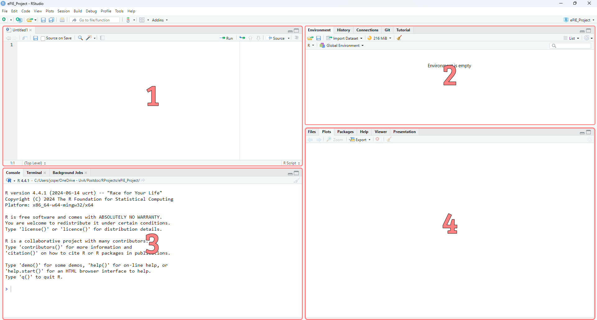
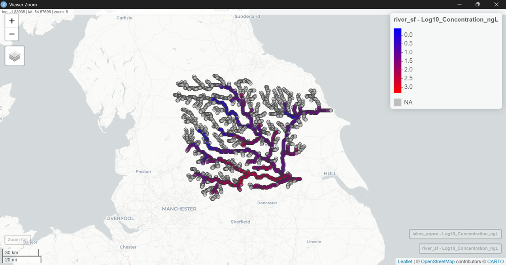
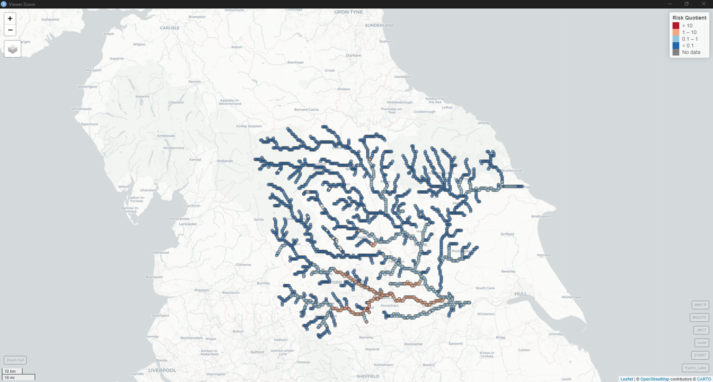
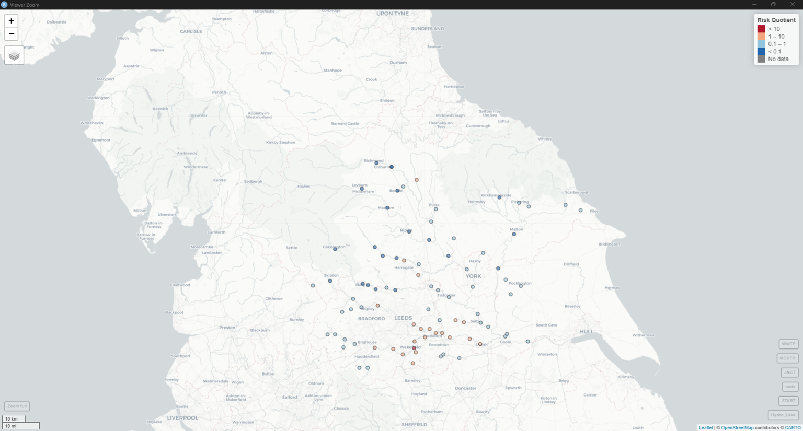

## Installing *R* and RStudio

*R* is a free, open-source programming language and software environment for statistical computing and graphics. In order to run the ePiE package, it is mandatory to have *R* installed. Installation of RStudio is not mandatory. However, RStudio provides a user-friendly interface for *R*. It makes it easier to write, run, and debug *R* code, and it provides tools for visualizing data and managing projects. Please follow the steps below to install *R* and RStudio. This manual is not intended to provide users with a full instructions on how *R* works. Nevertheless, it will provide all necessary instructions to run ePiE in *R*, assuming limited knowledge of the programming language.

**Step 1: Install *R***

1.  Go to the [Comprehensive R Archive Network
    (CRAN)](https://cran.r-project.org/).

2.  Click on the download link for your operating system (Windows,
    macOS, or Linux).

3.  Run the installer and follow the on-screen instructions.

**Step 2: Install RStudio**

1.  Go to the [RStudio download
    page](https://www.rstudio.com/products/rstudio/download/).

2.  Download the free version of **RStudio Desktop**.

3.  Run the installer and follow the on-screen instructions.

## RStudio 

When opening RStudio you should see a similar window as the one below. 


<figcaption>Figure X: Dummy caption.</figcaption>

RStudio is divided into four main panels:

- **Source** (top-left, 1): Write and save your R scripts here
- **Environment** (top-right, 2): Lists all objects currently loaded in memory (data frames, variables, functions)
- **Console** (bottom-left, 3): Executes R code and displays output; commands can be typed directly or run from the Source panel
- **Files / Plots / Help** (bottom-right, 4): Browse files, view plots, active packages, and access R documentation

It is ***strongly*** recommended to work inside an **RRoject**. The advantage of working within an RProjects is that the working directory is automatically set to the project folder, making all file paths relative and reproducible across different machines. Furthermore, all related raw data and generated data can be stored inside the project folder. For more information, please refer to the following references:

- [https://r4np.com/03_setting_up_r_rstudio.html](https://r4np.com/03_setting_up_r_rstudio.html)
- [https://support.posit.co/hc/en-us/articles/200526207-Using-RStudio-Projects](https://support.posit.co/hc/en-us/articles/200526207-Using-RStudio-Projects)
- [https://r4np.com/06_starting_r_projects.html](https://r4np.com/06_starting_r_projects.html)

Moreover, below is a short list of some useful and frequently used shortcuts:

| Action | Windows / Linux | macOS |
|---|---|---|
| Run current line / selection | `Ctrl + Enter` | `Cmd + Enter` |
| Assignment operator  | `Alt + -` | `Option + -` | 
| Pipe operator `%>%` | `Ctrl + Shift + M` | `Cmd + Shift + M` |
| Comment / uncomment lines | `Ctrl + Shift + C` | `Cmd + Shift + C` |
| Find and replace | `Ctrl + F` | `Cmd + H???` |
| Knit / render document | `Ctrl + Shift + K` | `Cmd + Shift + K` |

Note: By default Ctrl/Cmd + Shift + M inserts the `magrittr` pipe `%>%`. To use the new, native *R* pipe `|>` instead, go to the navigation bar of RStudio at the top under *Tools* → *Global Options* → *Code* and check *Use native pipe operator*.


## The *R* ePiE package

Before running the ePiE model, you need to install some additional
packages. These packages provide extra functionality for handling data,
maps, and calculations. In the console panel, copy and paste the
following code, then press Enter. The code will check if the required
packages are installed. If not, the packages will be installed automatically.

```R
 # Install dependencies 
 if(!require("Rcpp")) install.packages("Rcpp")       # For source code in C++
 if(!require("terra")) install.packages("terra")     # For flow rasters
 if(!require("sf")) install.packages("sf")           # For rivers and lakes
 if(!require("mapview")) install.packages("mapview") # For interactive maps
```

The ePiE package is not yet available on CRAN. Accordingly, it needs to
be installed directly from GitHub. Copy and paste the appropriate
command for your operating system into the console and press Enter:

```R
# Windows
install.packages("https://github.com/SHoeks/ePiE/raw/refs/heads/main/Builds/ePiE_1.25.zip",
                  repos = NULL,
                  method = "libcurl")
# macOS
install.packages("https://github.com/SHoeks/ePiE/raw/refs/heads/main/Builds/ePiE_1.25.tgz",
                 repos = NULL,
                 method = "libcurl")
# Linux
install.packages("https://github.com/SHoeks/ePiE/raw/refs/heads/main/Builds/ePiE_1.25.tar.gz",
                 repos = NULL,
                 method = "libcurl")
```

Afterwards the ePiE package can be loaded with the following command:

```R
 library(ePiE)
```

## API Properties

API properties are exemplary included for ibuprofen. These can be loaded with 
`LoadExampleChemProperties()` as shown below.


```R
# Open API-specific data
chem = LoadExampleChemProperties()
```

```R
# View the contents of the chemical properties
str(chem)
``` 

```R
# 'data.frame':    1 obs. of  23 variables:
#  $ API                            : chr "Ibuprofen"
#  $ CAS                            : chr "15687-27-1"
#  $ class                          : chr "acid"
#  $ MW                             : num 206
#  $ KOW_n                          : num 9333
#  $ Pv                             : num 0.0248
#  $ S                              : num 21
#  $ pKa                            : num 4.85
#  $ f_u                            : num 0.2
#  $ f_f                            : logi NA
#  $ metab                          : logi NA
#  $ API_metab                      : logi NA
#  $ k_bio_wwtp_n                   : num 0.000197
#  $ k_bio_wwtp_alt                 : num 0.000197
#  $ custom_wwtp_primary_removal    : logi NA
#  $ custom_wwtp_secondary_removal  : logi NA
#  $ custom_wwtp_N_removal          : num 0
#  $ custom_wwtp_P_removal          : num 0
#  $ custom_wwtp_UV_removal         : num 0
#  $ custom_wwtp_Cl_removal         : num 0
#  $ custom_wwtp_O3_removal         : num 0
#  $ custom_wwtp_sandfilter_removal : num 0
#  $ custom_wwtp_microfilter_removal: num 0
```

To load in data for a different desired API, a custom data file in any *R* readable format can be used (e.g., .csv, .xlsx). The template of the ePiE webapp can be used for this purpose; it is also included below as an .xlsx or .csv file.[^10]

[^10]: To do: Include template file as .xlsx and .csv 


[Template CSV; FILE NOT INCLUDED YET](Template CSV){: .md-button download="ePiE_R_API_template_CSV"}
[Template XLSX; FILE NOT INCLUDED YET](Template XLSX){: .md-button download="ePiE_R_API_template_XLSX"}

```R
df_metoprolol <- read.csv("DATA_FILE.csv", header = TRUE, sep = ";") # .csv
df_metoprolol <- readxl::read_excel("DATA_FILE.xlsx") # .xlsx. Ensure that readxl is installed!

```

Similar to the web application, the ePiE package includes example data
for Ibuprofen. Again, we will use to this data to run the model. Copy
and paste the following code into the console. It will load the chemical
properties of ibuprofen and fills in any missing values automatically.
These values are the same values as presented in the web application.

```R
chem = CompleteChemProperties(chem = chem)
```

## WWTP Removal

To estimate the removal fractions inside the WWTP, the SimpleTreat model
is used. Copy and paste the following code into the console:

```R
removal = SimpleTreat4_0(chem_class = chem$class[1], MW = chem$MW[1], Pv = chem$Pv[1], S =  chem$S[1], pKa = chem$pKa[1], Kp_ps = chem$Kp_ps[1], Kp_as = chem$Kp_as[1], k_bio_WWTP = chem$k_bio_wwtp[1], T_air = 285, Wind = 4, Inh = 1000, E_rate = 1, PRIM = -1, SEC = -1)
```

## River basin

Getting European river basins IDs can be achieved using the following
code. With the `ViewBasinsMap()` function, an interactive map will open up
that allows you to select individual basins similar to the web
application.

```R
    basins = LoadEuropeanBasins()
    ViewBasinMap()
```

To select individual basins, their id number needs to be attached to an
object, which will be used as input argument to actually select the
specific river basins.


```R
    basin_ids = c(124863, 107287) # Rhine and Ouse
    basins = SelectBasins(basins_data = basins, basin_ids = basin_ids)
```

The flow conditions can be specified as shown below. Other options for the `LoadLongTermFlow()`
function are “maximum” and “minimum”.

```R
    flow = LoadLongTermFlow("average")
    basins = AddFlowToBasinData(basin_data = basins, flow_rast = flow_avg)
```


## API Consumption

Next we load the consumption data for ibuprofen with the code below.

    # Load example consumption data
    cons = LoadExampleConsumption()

Please note that for other compounds the respective data frame needs to
contain exactly the same column names and data type (i.e character `chr` & numeric `num`) as shown below. Countries `cnt` are indicated by their two-letter country code following the ISO 3166-1 alpha-2.

```R
str(cons)

# 'data.frame':    51 obs. of  4 variables:
#  $ cnt       : chr  "AD" "AL" "AM" "AT" ...
#  $ population: num  76177 2862427 2965269 8858775 9981457 ...
#  $ year      : num  2019 2019 2019 2019 2019 ...
#  $ Ibuprofen : num  343 12881 13344 39864 44917 ...
```

We need to ensure that the consumption data is available for the
selected basins. This can be achieved with the following code

```R
cons = CheckConsumptionData(basins$pts, chem, cons)
```

## Run ePiE

All required parameters have now been specified and ePiE is able to
predict the environmental concentrations. The code below runs the ePiE
model and attaches it to an object called “results”.

```R
results = ComputeEnvConcentrations(
  basin_data = basins_avg,
  chem = chem,
  cons = cons,
  verbose = TRUE,
  cpp = TRUE)
```

The structure of the data is shown below:

```R
str(results)
```

```R
List of 2
 $ pts:'data.frame':	45404 obs. of  12 variables:
  ..$ ID         : chr [1:45404] "L_1319335-17" "L_1319335-22" "L_1319859-45" "L_1319859-54" ...
  ..$ ID_nxt     : chr [1:45404] "L_1319335-22" "P_148" "P_439" "P_461" ...
  ..$ Pt_type    : chr [1:45404] "Hydro_Lake" "Hydro_Lake" "Hydro_Lake" "Hydro_Lake" ...
  ..$ Hylak_id   : int [1:45404] 1319335 1319335 1319859 1319859 1320257 1320257 1320257 1320257 1320335 1320335 ...
  ..$ x          : num [1:45404] -1.62 -1.62 -2.12 -2.13 -1.76 ...
  ..$ y          : num [1:45404] 54.4 54.4 54.3 54.3 54.2 ...
  ..$ Q          : num [1:45404] 11.97 12.11 1.3 1.28 0.39 ...
  ..$ C_w        : num [1:45404] NaN 0.00688 0 NaN NaN ...
  ..$ C_sd       : num [1:45404] NaN 0.509 0 NaN NaN ...
  ..$ WWTPremoval: num [1:45404] NA NA NA NA NA NA NA NA NA NA ...
  ..$ API        : chr [1:45404] "Ibuprofen" "Ibuprofen" "Ibuprofen" "Ibuprofen" ...
  ..$ basin_id   : chr [1:45404] "107287" "107287" "107287" "107287" ...
 $ hl :'data.frame':	317 obs. of  5 variables:
  ..$ Hylak_id: int [1:317] 163383 163431 1319335 1319859 1320257 1320335 1320350 1320668 1321231 1321378 ...
  ..$ C_w     : num [1:317] 0 0 0.00688 0 0 ...
  ..$ C_sd    : num [1:317] 0 0 0.509 0 0 ...
  ..$ basin_id: chr [1:317] "107287" "107287" "107287" "107287" ...
  ..$ API     : chr [1:317] "Ibuprofen" "Ibuprofen" "Ibuprofen" "Ibuprofen" ...


```

We can see in the output the `results` object is a list, containing two data frames with the following columns:

| Column | Explanation | 
|---|---|
| ID| The ID of an individual node |
| ID_nxt| The ID of the next node in the river system |
| Pt_type| Indication of the node type. See previous section |
| Hylak_id| ID of a lake node |
| x| X-coordinates of an individual node |
| y| Y-coordinates of an individual node |
| Q| Water flow <mark>[m3 s‐1] |
| C_w| Predicted concentration in the water [µg/L]|
| C_sd| Predicted concentration in the sediment [µg/kg]|
| WWTPremoval| (Predicted) removal in the WWTP |
| API| The current API |
| basin_id| Basin ID of the current selected basin |


## Map results 

Visualising the predicted concentrations can be achieved with the code
below.

```R
InteractiveResultMap(results, basin_id = basin_ids[2], cex = 4) # Ouse
```

Which produces an interactive map as seen below. Grey colours indicate NA values and blue and red colour indicating low and high PECs.


<figcaption>Figure X: Dummy caption.</figcaption>

## Output statistics

Next we want to calculate summary statistics for the predicted concentrations. For this, we are using functionalities provided by the `dplyr` package. If you do not have `dplyr` installed, please install it. Alternatively, you can also install the `tidyverse`, which is a collection of packages that are frequently used to analyse and visualise data.

```R
library(dplyr)

PEC_summary_stats <- results$pts %>%
  group_by(API, basin_id) %>%
  summarise(
    mean_conc = mean(C_w, na.rm = TRUE),
    perc5_conc = quantile(C_w, 0.05, na.rm = TRUE),
    median_conc = median(C_w, na.rm = TRUE),
    perc95_conc = quantile(C_w, 0.95, na.rm = TRUE),
    mean_WWTP_conc = mean(C_w[Pt_type == "WWTP"], na.rm = TRUE),
    median_WWTP_conc = median(C_w[Pt_type == "WWTP"], na.rm = TRUE)
  )
```

## Risk statistics

To calculate risk quotients (RQs), the respective risk threshold value needs to be added to the data.
For simplicity, we are using here the default value of 10 ng/L that is also used on the ePiE web application. As the ePiE *R* package is using µg/L for its predicted concentration, the value needs to be converted to 10000.

```r
results$pts$risk_threshold <- 10000
RQ <- results$pts %>% mutate(
  RQ = C_w / risk_threshold
)
```

 Afterwards, the summary statistics for the RQs can be calculated as well as exemplary shown below.

```R
RQ_summary_stats <- RQ %>% 
group_by(API, basin_id) %>%
  summarise(
    abs.RQ_less_0.1 = sum(RQ < 0.1, na.rm = TRUE),
    abs.RQ_0.1_to_1 = sum(RQ >= 0.1 & RQ <= 1.0, na.rm = TRUE),
    abs.RQ_1_to_10 = sum(RQ >= 1 & RQ <= 10, na.rm = TRUE),
    abs.RQ_abv_10 = sum(RQ >= 10, na.rm = TRUE),
    tot.RQ = n(),
    rel_RQ_less_0.1 = abs.RQ_less_0.1 / tot.RQ,
    rel_RQ_0.1_to_1 = abs.RQ_0.1_to_1 / tot.RQ,
    rel_RQ_1_to_10 = abs.RQ_1_to_10 / tot.RQ,
    rel_RQ_abv_10 = abs.RQ_abv_10 / tot.RQ,
    .groups = "keep"
  ) %>%
  select(-matches(c("tot.", "abs.")))
```

## Map risks

ePiE does not yet include an internal function to plot risk quotients (RQs). However, this can be achieved by the code below.

```R
library(sf)
library(mapview)
library(leaflet)
library(RColorBrewer)

mapviewOptions(basemaps = c("CartoDB.Positron",
                            "OpenStreetMap",
                            "CartoDB.DarkMatter",
                            "Esri.WorldImagery",
                            "Esri.WorldTopoMap"))

rq_labels      <- c("> 10", "1 – 10", "0.1 – 1", "< 0.1")
rq_colors_named <- c("> 10"    = "#B2182B",
                     "1 – 10"  = "#F4A582",
                     "0.1 – 1" = "#92C5DE",
                     "< 0.1"   = "#2166AC")

df_sf_rq <- RQ |>
  filter(API == "Ibuprofen", flow == "avg", basin_id == "107287") |>
  mutate(RQ     = ifelse(is.nan(RQ), NA_real_, RQ),
         RQ_cat = cut(RQ,
                      breaks         = c(0, 0.1, 1, 10, Inf),
                      labels         = c("< 0.1", "0.1 – 1", "1 – 10", "> 10"),
                      include.lowest = TRUE,
                      right          = FALSE),
         RQ_cat  = factor(RQ_cat, levels = rq_labels),
         RQ_color = rq_colors_named[as.character(RQ_cat)]) |>
  st_as_sf(coords = c("x", "y"), crs = 4326)

pal_cat <- colorFactor(palette  = rq_colors_named,
                       levels   = rq_labels,
                       na.color = "grey")

map_list_rq <- lapply(unique(df_sf_rq$Pt_type), function(t) {
  sub_sf <- df_sf_rq |> filter(Pt_type == t)
  mapview(sub_sf,
          col.regions = sub_sf$RQ_color,
          cex         = 4,
          layer.name  = t,
          label       = paste0("RQ: ", round(sub_sf$RQ, 4)),
          legend      = FALSE)
})

Reduce("+", map_list_rq)@map |>
  addLegend(position = "topright",
            pal      = pal_cat,
            values   = df_sf_rq$RQ_cat,
            na.label = "No data",
            title    = "Risk Quotient",
            opacity  = 1)

```
Which produces the following map:


<figcaption>Figure X: Dummy caption. <br>
<mark>Note: The above figure is wrong. Different PNEC.
</figcaption>


 Additionally, the code above also allows to filter between node types by selecting the node type of interest on the left side. For example, only WWTPs could be plotted. 

 
<figcaption>Figure X: Dummy caption. <br>
<mark>Note: The above figure is wrong. Different PNEC.

</figcaption>


 
