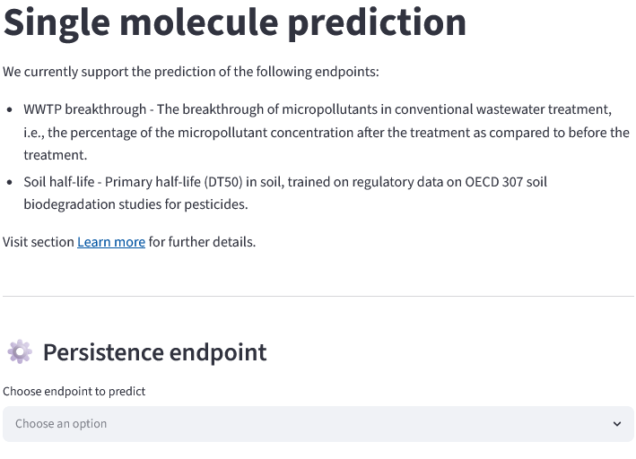

## Run the model yourself 

- Atenolol: 
- Metoprolol:
- Gabapentin:

- Please collect MW, Vp, and S from Pubchem
- Metoprolol, Gabapentin, Atenolol, PREMIER DAS: pKA, Log P
- Koc from Chemspider or comptox. Remember to take the logarithmic value
- f_uf = Drugbank
- Provide ATC, CAS, and SMILES. Average consumption for the year 2019
- Note down where the data is coming from in an individual data file
- Fill in the data template for ePiE
- Run ePiE for your desired river basin under average scenarios

- Questions: Do the predicted concentrations make sense? How would you assess if the model results are realistic?
- In which order would you priortise these APIs, not knowing their potential RQs?
- Under the assumption that you do not have any available effect data, how could you further assess their potential environmental risks? Read across or check their hazard properties for PBT or PMT, or vPvM. River basin specific, if there is a drinking water production area, these APIs might carry risks for consumers. However, as these APIs are administered at much higher, safer doses, such acute risks are unlikely. However, chronic risks would be an issue. Monitor the situation

## The PEPPER model

ePiE stands out for its high degree of customizability. Most parameters can be overwritten, allowing users to use experimental data or other models such as PEPPER (Predict Environmental Pollutant PERsistence).

The PEPPER model was developed using large-scale monitoring data from WWTP applying secondary treatment with activated sludge and covers over 1000 chemicals applying a random-forest model to predict the WWTP breakthrough of anthropogenic chemicals. These predictions are based on the chemical structure alone and also allow to asses their half-life in soil. PEPPER is freely accessible as a web application via the following [link](https://pepper-app.streamlit.app/). More information on the PEPPER model can be found under the web application or in its respective publication by [Cordero Solano et al. (2025)](https://pubs.acs.org/doi/full/10.1021/acs.est.5c09314).

To use PEPPER, please follow the points outlined below:

1. Go to the PEPPER website
2. Click on "Single Molecule" (Figure 1)

    
    <figcaption>Figure 1</figcaption>

3. Choose "WWTP breakthrough" as endpoint to predict (Figure 2)

    
    <figcaption>Figure 2</figcaption>

4. Choose one of the example chemicals, such as Sulfamethoxazole (Option 1), or provide the SMILES (Option 2) (Figure 3) 
5. Click "OK" (Figure 3)

    
    <figcaption>Figure 3</figcaption>

PEPPER calculates the breakthrough (%) of a compound, which is the fraction of a compound that is *not* removed (Figure 4). ePiE, however, requires the removed fraction. Accordingly, the breakthrough needs to be converted to the removed fraction. For example, PEPPER calculates a breakthrough of 50.2 % for sulfamethoxazole, which translates to 49.8 % removal. This value can be used under the "WWTP removal" tab as input value for either the primary or secondary removal fraction. For example, by setting the primary removal fraction to 0, and the secondary removal fraction to 0.498. PEPPER also provides a confidence metric and results close to 0 should be used with care!

